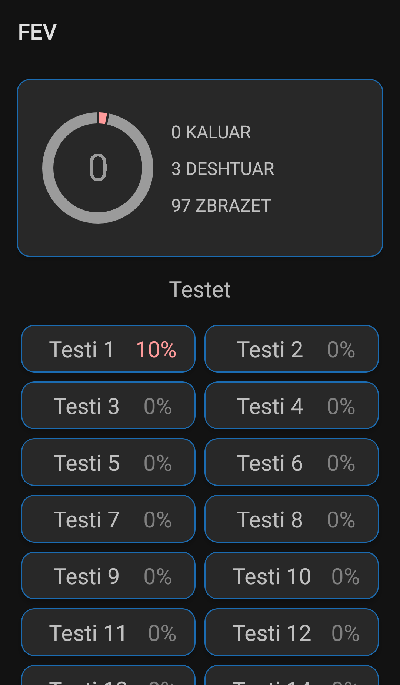
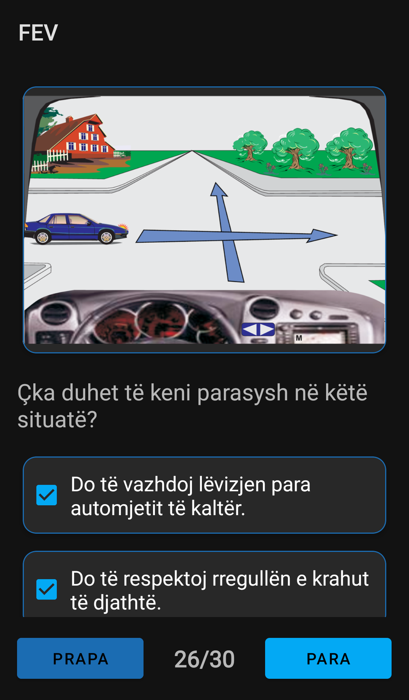
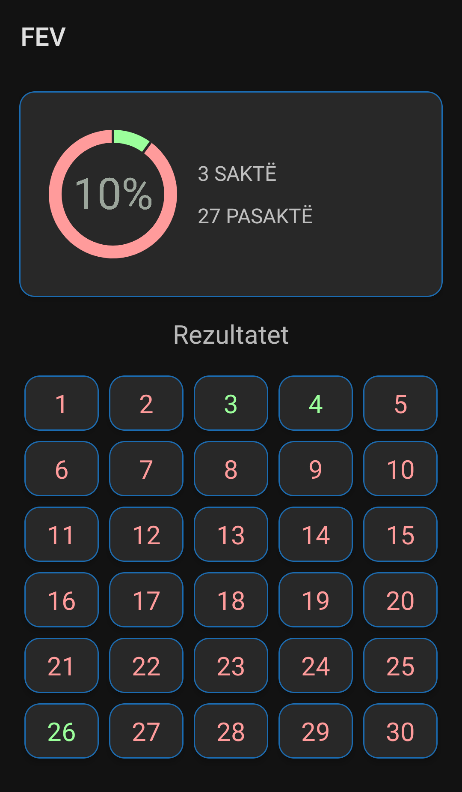

 
	

<h1 align="center">
FEV - FEV's Exam for Vehicles
</h1>

A mock testing application for the grade B vehicle exam in Kosovo

## Screenshots

## Features

- Take 100 exams featuring random questions from 8 categories (we made sure you wont miss one question).

- See the result of all the tests you've taken (at any time - COMING SOON).

- UX driven interface.

- No google or intrusive ads.

## Source of questions and images

All of the data in this application is taken straight [from the PDF provided](https://www.mit-ks.net/sq/rregullat-e-komunikacionit-38) by the Ministry of Infrastructure of the Republic of Kosovo, with 0 original/extra content, if you see any mistakes please contact me.

# Contact

Email me.

# Licensing

## Source Code

Copyright (C) 2022 simplicity-load

This program is free software: you can redistribute it and/or modify it under the terms of the GNU Affero General Public License as published by the Free Software Foundation, either version 3 of the License, or (at your option) any later version.

This program is distributed in the hope that it will be useful, but WITHOUT ANY WARRANTY; without even the implied warranty of MERCHANTABILITY or FITNESS FOR A PARTICULAR PURPOSE. See the GNU Affero General Public License for more details.

You should have received a copy of the GNU Affero General Public License along with this program. If not, see https://www.gnu.org/licenses/.

## Images and Graphics

[Creative Commons Attribution 4.0 International (CC BY-NC-SA 4.0)](https://creativecommons.org/licenses/by-nc-sa/4.0/).
